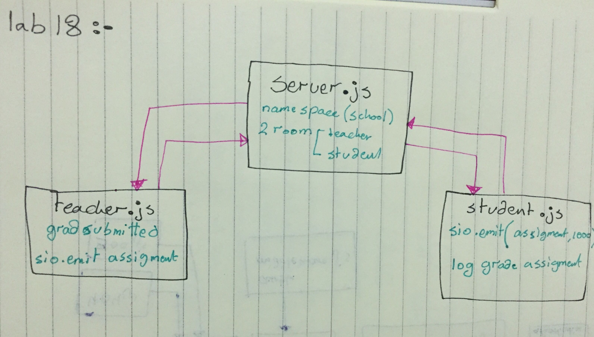

# lab-18 - Socket.io
## Author: As'har oran
## Links and Resources
* (pull Request) : []
* Action : []
How to initialize/run your server app
run commands in three seperate terminals
* node server.js
* node teachers/teachers.js
* node students/student.js
## Tests
* Unit Tests: npm test
Lint Tests: npm run lint

## UML
